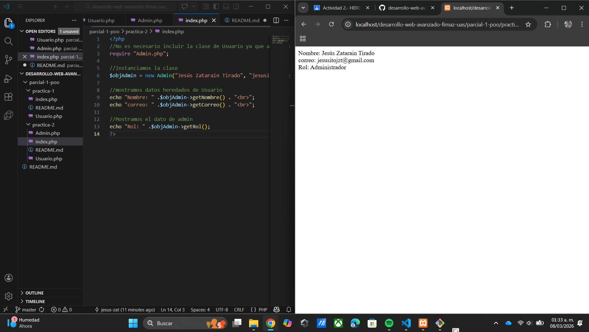

# Documentacion

## Explicacion de la herencia aplicada
La clase Admin hereda de Usuario  usando extends, Esto quiere decir que Admin
obitene las propiedades y metodos de Usuario, tambien Admin puede agregar sus 
propios metodos y utilizarlos

## Diferencia entre Usuario y Admin
La clase Usuario tiene información como nombre y correo. La clase Admin hereda todo 
lo que tiene Usuario, por lo que puede usar su información y además tiene cosas propias 
como saber su rol. La diferencia principal es que Usuario no puede hacer lo que hace Admin,
mientras que Admin puede hacer todo de Usuario y algo extra.

## Evidencia de ejecucion 
